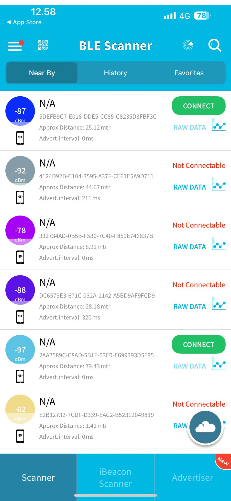

# BLE Investigation and Analysis Report

## Objective
To investigate and analyze nearby Bluetooth Low Energy (BLE) devices and understand their signal characteristics and security implications within a classroom environment.

---

## 1. Description of Scanning Environment
* **Environment:** Classroom (Indoor).
* **Setup:** A single-point passive scan was conducted using a mobile device positioned at a central desk.
* **Conditions:** The room contained various electronic devices (laptops, smartboards) and multiple students with personal wearables and smartphones.
* **Protocol:** To respect privacy and adhere to ethical scanning standards, **no connections** were established with any detected devices. The scan relied solely on public advertising packets.

---

## 2. Collected Data
The following data was captured during the classroom scan. All detected devices displayed "N/A" for the Device Name field, indicating they were either not broadcasting a friendly name or were using randomized identifiers to enhance privacy.

### Scan Data Table
| Device Identifier (UUID/MAC) | Signal Strength (RSSI) | Approx. Distance | Connectable |
| :--- | :--- | :--- | :--- |
| `E2B12732-7CDF-D339...` | -62 dBm | 1.41 m | No |
| `332734AD-0B5B-F530...` | -78 dBm | 8.91 m | No |
| `5DEFB9C7-E018-DDE5...` | -87 dBm | 25.12 m | Yes |
| `DC6579E3-671C-032A...` | -88 dBm | 28.18 m | No |
| `4124D92B-C104-3595...` | -92 dBm | 44.67 m | No |
| `2AA7589C-C8AD-5B1F...` | -97 dBm | 79.43 m | Yes |

### Screenshots
*(Note: Upload your image file to the repository and ensure the filename matches below)*

---

## 3. Technical Analysis
* **RSSI vs. Distance:** A clear correlation is observed: the strongest signal (-62 dBm) identifies the closest device (1.41m). As RSSI drops toward -97 dBm, the estimated distance increases significantly.
* **Environmental Impact:** The classroom walls and furniture likely cause signal attenuation and multipath fading. This is evidenced by the device at -97 dBm (79.43m), which is likely located outside the room in a different wing of the building.
* **Connectability:** Only 33% (2 out of 6) of visible devices were "Connectable." Most devices were in a "non-connectable" advertising mode, likely acting as simple beacons or already-paired peripherals.

---

## 4. Security & Privacy Considerations
BLE is essential for IoT, but its "always-on" nature introduces several risks:

* **Fingerprinting:** BLE frequently broadcasts signals to remain low-power. These signals can serve as a unique identifier to "fingerprint" a specific device.
* **Movement Profiling:** By correlating these identifiers across different locations, an attacker can create a detailed movement profile of the user.
* **Information Leakage:** Broadcast names or GATT services can reveal the exact make and model of a device, allowing for targeted exploits.
* **Passive Tracking:** Because the attacker does not need to interact with the device to see these broadcasts, it is extremely difficult for a user to detect that they are being tracked or eavesdropped upon.

---

## 5. Final Conclusions
The investigation demonstrates that while BLE provides convenient low-power connectivity, it leaves a significant "digital footprint." Even without a friendly name being broadcast, the unique UUIDs and persistent signal emissions make devices vulnerable to passive tracking. This highlights the importance of MAC address randomization and restricted advertising in modern IoT security.
